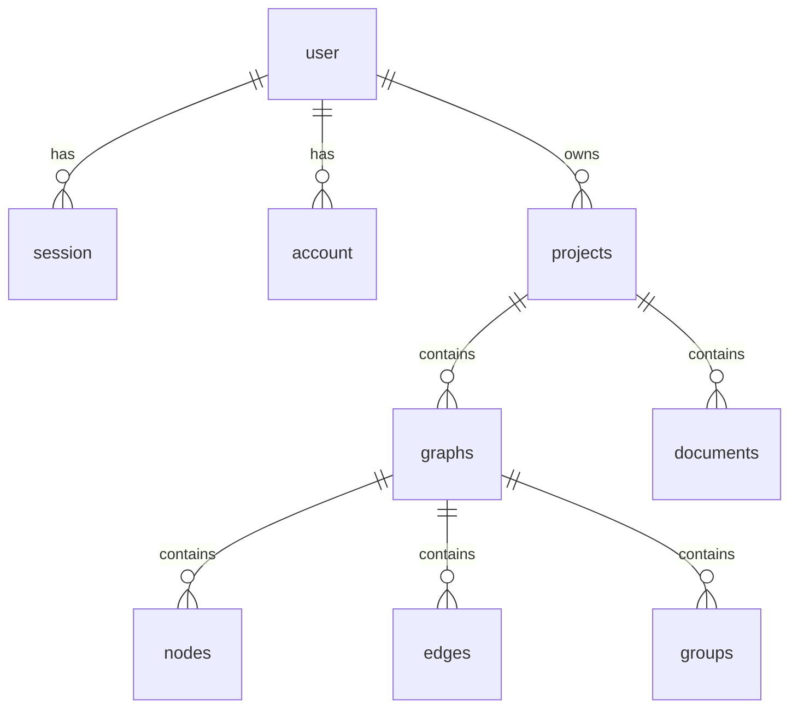

# Database Schema & Authentication

This document outlines the PostgreSQL relational database schema and the Better Auth authentication system used by HUPA.

---

## PostgreSQL Database Schema

The database schema (`supabase/migrations/20260821000000_initial_schema.sql`) contains two primary modules:
1. **Authentication & Session Tables** (managed by Better Auth)
2. **HUPA Project Graph Tables** (managed by the HUPA API)

### Core Tables



### Table Definitions

- **`user`**: `id`, `name`, `email`, `emailVerified`, `image`, `createdAt`, `updatedAt`
- **`session`**: `id`, `userId`, `token`, `expiresAt`, `ipAddress`, `userAgent`, `createdAt`, `updatedAt`
- **`account`**: `id`, `userId`, `accountId`, `providerId`, `password`, `createdAt`, `updatedAt`
- **`projects`**: `id`, `name`, `description`, `domain`, `type`, `version`, `root_graph_id`, `owner_id`, `created_at`, `updated_at`
- **`graphs`**: `id`, `project_id`, `parent_node_id`, `parent_graph_id`, `name`, `description`, `created_at`, `updated_at`
- **`nodes`**: `id`, `project_id`, `graph_id`, `type`, `name`, `description`, `status`, `priority`, `position`, `size`, `properties`, `tags`, `updated_at`
- **`edges`**: `id`, `project_id`, `graph_id`, `source_node_id`, `target_node_id`, `type`, `label`, `color`, `line_style`, `animated`, `updated_at`
- **`groups`**: `id`, `project_id`, `graph_id`, `name`, `category`, `color`, `position`, `size`, `is_collapsed`, `node_ids`, `updated_at`
- **`documents`**: `id`, `project_id`, `title`, `content`, `tags`, `linked_node_ids`, `updated_at`

---

## Authentication with Better Auth

HUPA utilizes **Better Auth** with the PostgreSQL pool adapter for robust, cookie-based session authentication.

### Server Implementation (`server/auth.ts`)
```typescript
import { betterAuth } from 'better-auth';
import { pool } from './db/pool';

export const auth = betterAuth({
  database: pool,
  emailAndPassword: {
    enabled: true,
    autoSignIn: true,
    minPasswordLength: 8,
  },
  session: {
    expiresIn: 60 * 60 * 24 * 30, // 30 days
    updateAge: 60 * 60 * 24,       // Refresh daily
  },
});
```

### Client Integration (`src/lib/authClient.ts`)
```typescript
import { createAuthClient } from 'better-auth/react';

export const authClient = createAuthClient({
  baseURL: getApiBaseUrl(),
});

export const { signIn, signUp, signOut, useSession } = authClient;
```

---

## Authorization & Ownership Verification

All privileged project routes (`server/routes/projects.ts`) require an authenticated session and verify that `project.owner_id === req.user.id`:

```typescript
const projectRes = await pool.query(
  'SELECT id FROM projects WHERE id = $1 AND owner_id = $2',
  [projectId, req.user.id]
);

if (projectRes.rowCount === 0) {
  return res.status(403).json({ error: 'Forbidden: Project not owned by user' });
}
```
